# Custom Trie

An Implementation of a non-compressed Prefix-Trie.

*For the standard, non-compressed implementation, see [Custom Compressed Trie](https://github.com/bk10aao/CustomCompressedTrie).*

# Build and Test

To build and test the project run command `./gradlew clean build`

# Time Complexity

| Method                         |         Time Complexity         |
|:-------------------------------|:-------------------------------:|
| **`insert(word)`**             |    $O(L \cdot \log \Sigma)$     |
| **`search(value)`**            |    $O(L \cdot \log \Sigma)$     |
| **`delete(word)`**             |    $O(L \cdot \log \Sigma)$     |
| **`startsWith(prefix)`**       | $O((P + M) \cdot \log \Sigma)$  |
| **`size()`**                   |             $O(1)$              |
| **`isEmpty()`**                |             $O(1)$              |
| **`clear()`**                  |             $O(1)$              |
| **`CustomTrie()`**             |             $O(1)$              |
| **`CustomTrie(List / Array)`** |    $O(W \cdot \log \Sigma)$     |
| **`CustomTrie(CustomTrie)`**   |    $O(W \cdot \log \Sigma)$     |
| **`equals(Object)`**           |    $O(W \cdot \log \Sigma)$     |
| **`hashCode()`**               |    $O(W \cdot \log \Sigma)$     |
| **`toString()`**               |    $O(W \cdot \log \Sigma)$     |

# Space Complexity

| Method                         |     Space Complexity     |
|:-------------------------------|:------------------------:|
| **`insert(word)`**             |          $O(L)$          |
| **`search(value)`**            |          $O(L)$          |
| **`delete(word)`**             |          $O(L)$          |
| **`startsWith(prefix)`**       | $O(M + L_{\text{max}})$  |
| **`size()`**                   |          $O(1)$          |
| **`isEmpty()`**                |          $O(1)$          |
| **`clear()`**                  |          $O(1)$          |
| **`CustomTrie()`**             |          $O(1)$          |
| **`CustomTrie(List / Array)`** |          $O(W)$          |
| **`CustomTrie(CustomTrie)`**   |          $O(W)$          |
| **`equals(Object)`**           |          $O(W)$          |
| **`hashCode()`**               |          $O(W)$          |
| **`toString()`**               |          $O(W)$          |

**Key**
* **$L$** - Length of the sanitized input word or search value.
* **$L_{\text{max}}$** - Maximum length of any single word in the trie (bounds recursion stack depth and `StringBuilder` buffer size).
* **$P$** - Length of the sanitized search prefix.
* **$M$** - Total character count across all matching words returned by a prefix query.
* **$W$** - Total sum of character lengths across all stored words in the trie ($\sum |w_i|$).
* **$\Sigma$** - Branching factor (number of unique child character edges at a node; introduces a $\log \Sigma$ factor for `TreeMap` lookups).

# Performance Charts

#### Note: The following performance charts are designed to be viewed in dark mode.
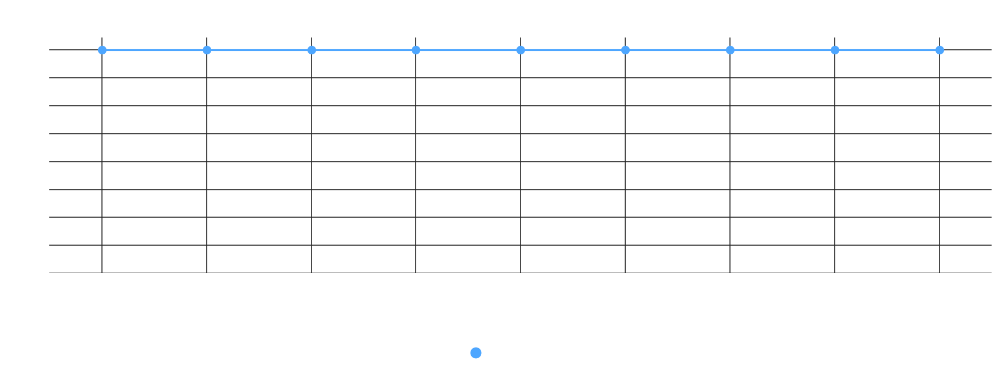
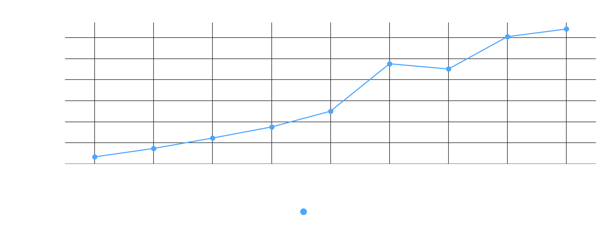
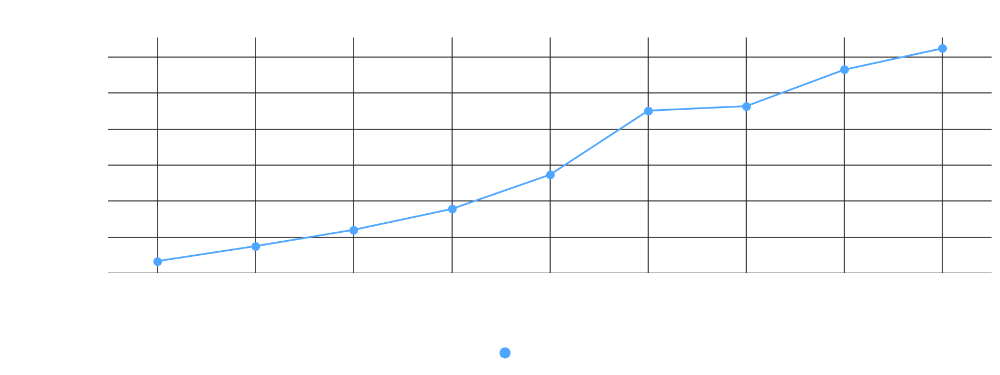
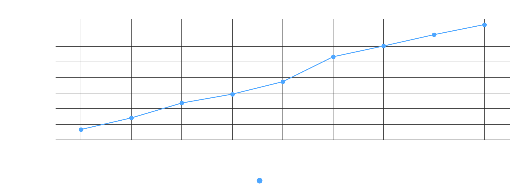
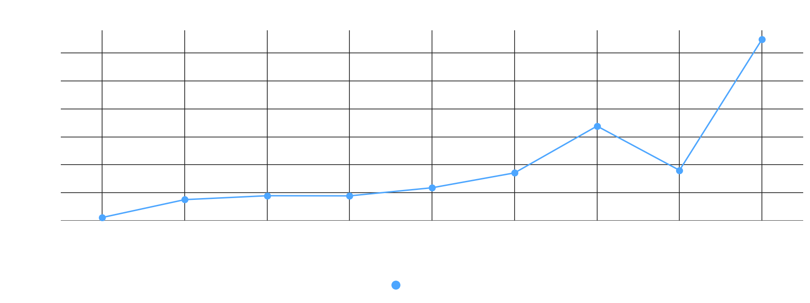
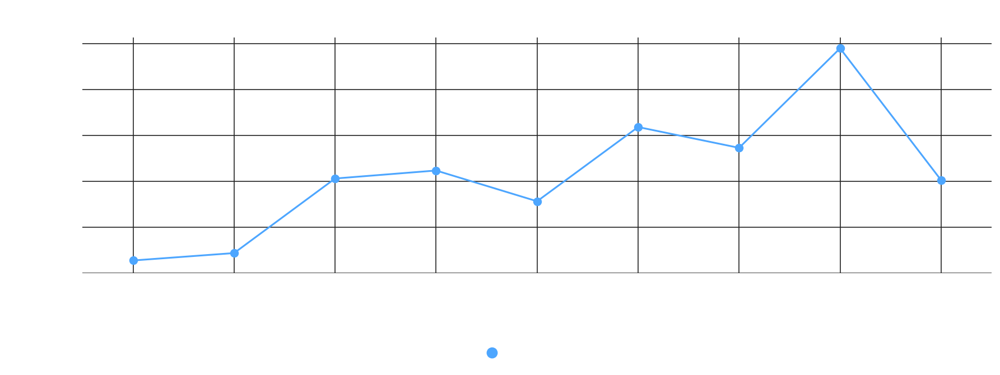
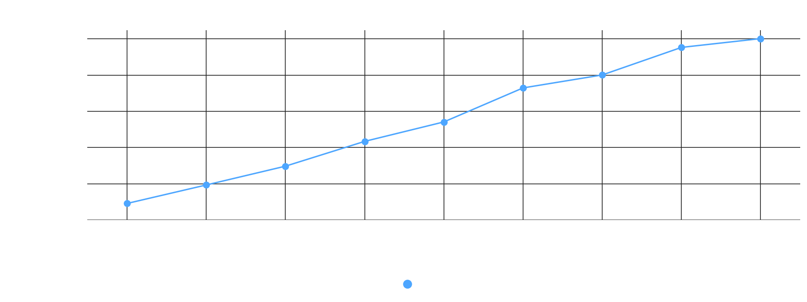
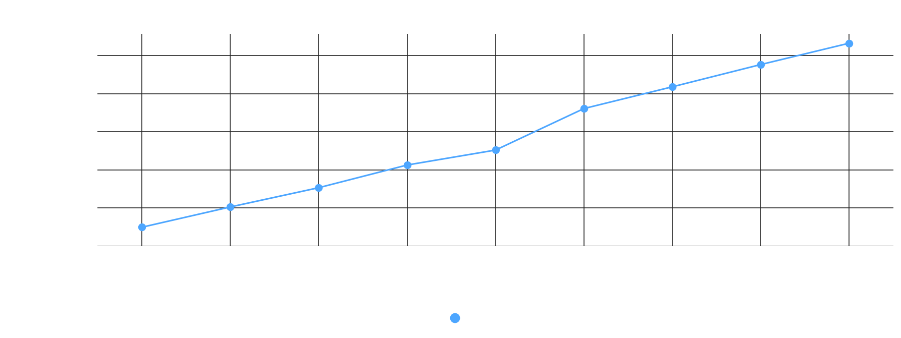
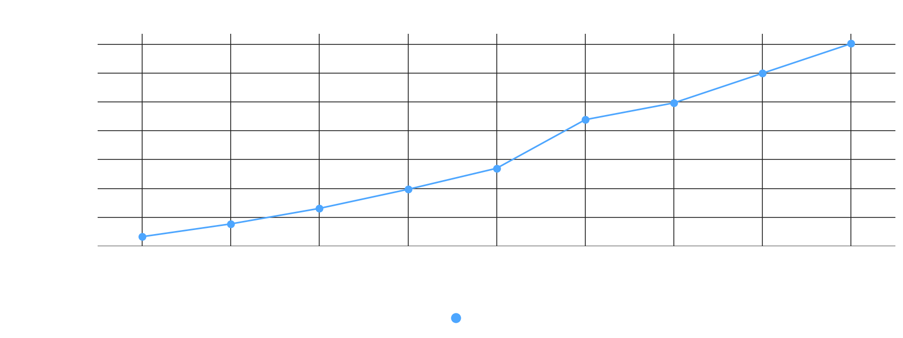
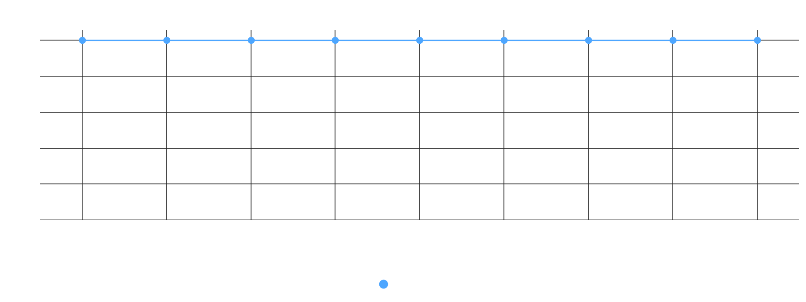
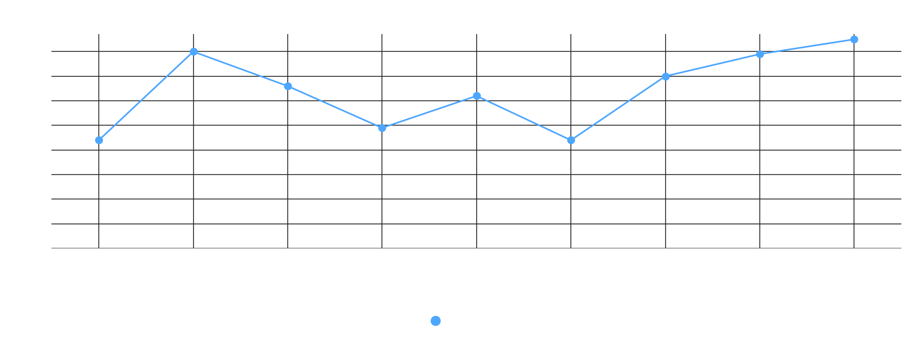

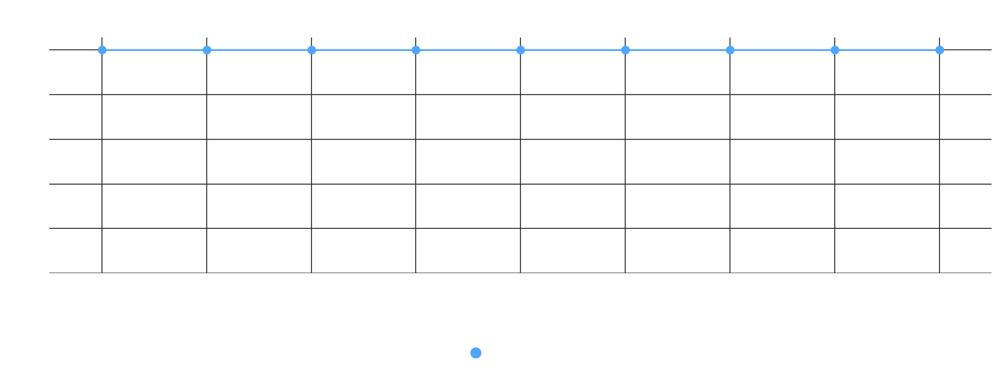
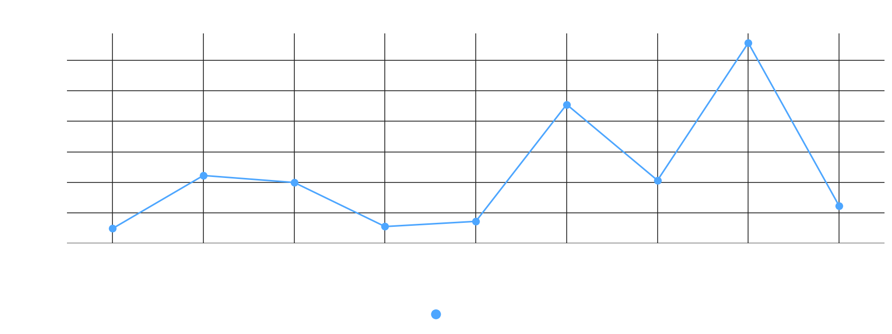